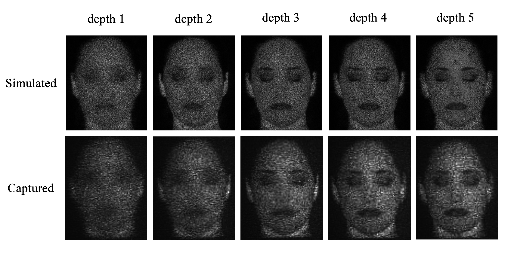
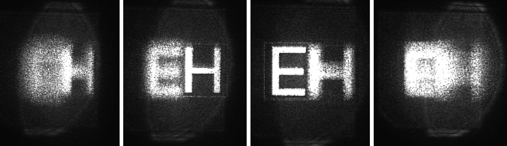
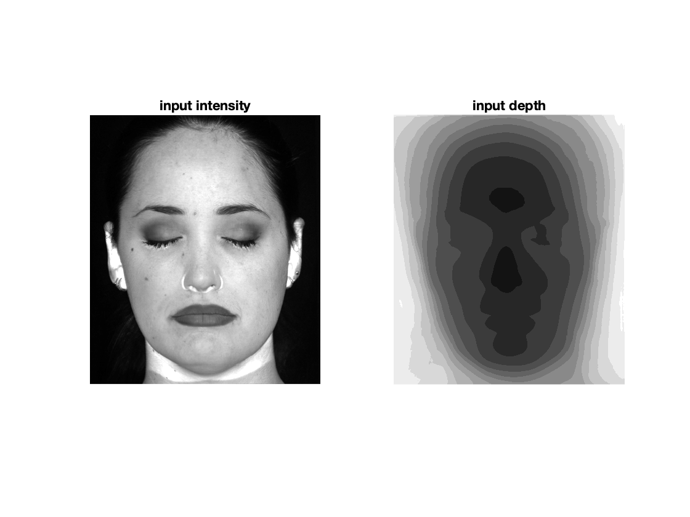
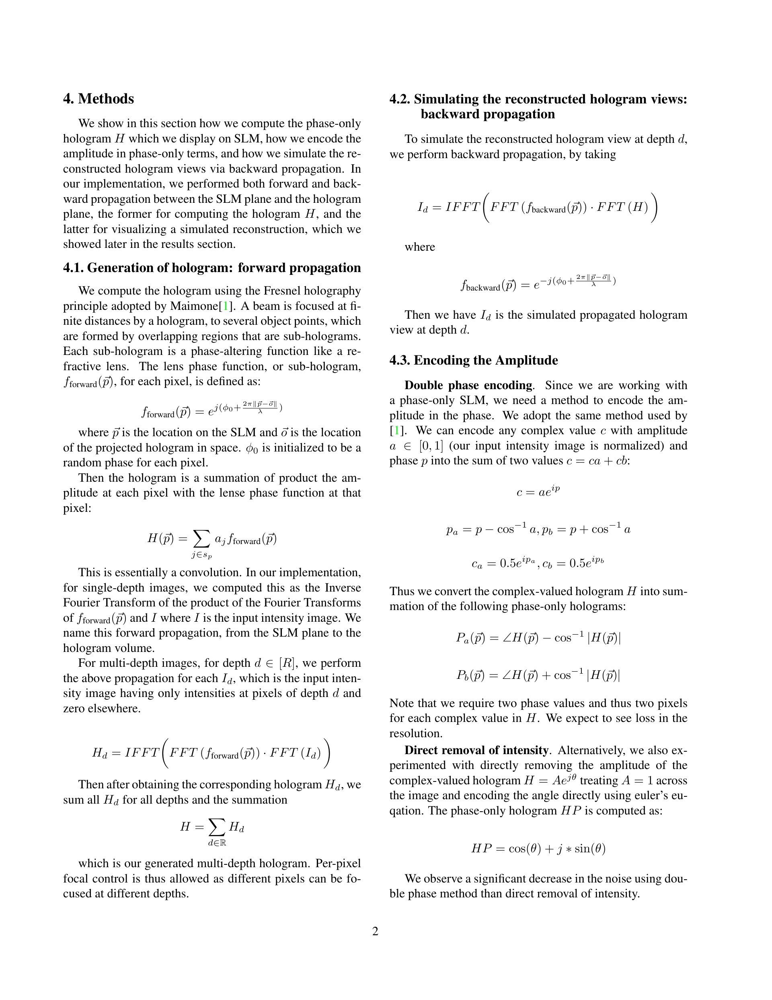

# 3DHologram

This project implements a 3D holographic projector. The 3D Computer Generated Hologram (CGH) we compute allows per-pixel focal length control. Our code described below computes a CGH from an input intensity image the corresponding input depth map image.

## Results

We only show a finite range of depths for demonstration. Per-pixel focal control is possible by using an input image where each pixel is at a different depth.

### Results (simulated and captured) for a multi-depth hologram
The focusing depth range of the hologram is `[0.020m, 0.021m]`.

We can see that from depth 1 to depth 5, different parts of the face are focused and de-focused. It is apparent that the ears and the face center are at different depths. When the face center is focused, the ears go out of focused, and vice versa. 

### Results (captured) for a 2-depth hologram
The focusing depth range of the hologram is `[0.070m, 0.080m]`. 

We can see that from left to right, the letter E and H get focused and de-focused interchangeably. It is apparent that the two depth planes are reconstructed.

During the experiments, we found a bright DC term in the propagated hologram. Theoretically, we can apply a linear phase ramp to the hologram and thus shift it away from the DC term and use an aperture to crop the DC term out. However, by applying a linear phase ramp, we are also skewing the shape of our 3D hologram volume. Therefore, instead of applying a linear phase ramp, we opted to capture the first order diffraction, which were not impacted as much by the strong DC output of the laser.

## Program

### Run Simulation
All codes are run in MATLAB.

To replicate my simulation results, `cd src` and run `simulateHologram.m`. This is the main file that calls either `propagateMultiDepths`, `propagate2Depths`, or `propagate2DepthsIter`.

The input images to the pipeline are in the `data/scenes/` folder. The input used for the multi-depth hologram above is:

 

where the depth map values is discretized into 13 depth value bins.

The generated outputs are:
- a Computed Generated Hologram (CGH), essentially a phase pattern to be displayed on the SLM. Scaled to the resolution of the SLM. Saved to the `data/CGH/` folder.
- simulated reconstructed views of the propagated hologram at different depths. Saved to the `data/reconstructions/` folder.

### Files

#### Functions
- `simulateHologram.m`: main program where physical parameters and input images are defined
- `propagate2Depths.m`: propagation function for an image of **2 depths**, depth `z1` for the left half, depth `z2` for the right half
- `propagate2DepthsIter.m`: **iterative propagation** function for an image of 2 depths; backward + forward count as one iteration of propagation
-  `propagateMultiDepths.m`: propagation function allowing **per-pixel focal control**; takes as input the file names of the intensity image and depth map image as well as the number of depths `numdepths` to discretize the depth map to
-  `genHolo1Depth.m`: forward propagation function to generate hologram `H`
-  `reconHoloAt1Depth.m`: backward propagation function to simulate a reconstructed hologram view
-  `encodeAmplitude.m`: encode a complex-valued hologram into a phase-only hologram using one of the two modes: the double phase method mode `dpe` and direct amplitude removal mode `amprm`

#### Data Files
- The `data` folder has:
  -  `CGH`: computed generated 3D holograms
  -  `experimentalresults`: the captured results using our optics setup
  -  `reconstructions`: the simulated results
  -  `scenes`: input images

## Methods
As explained in our `Final_Project_Report.pdf`:

