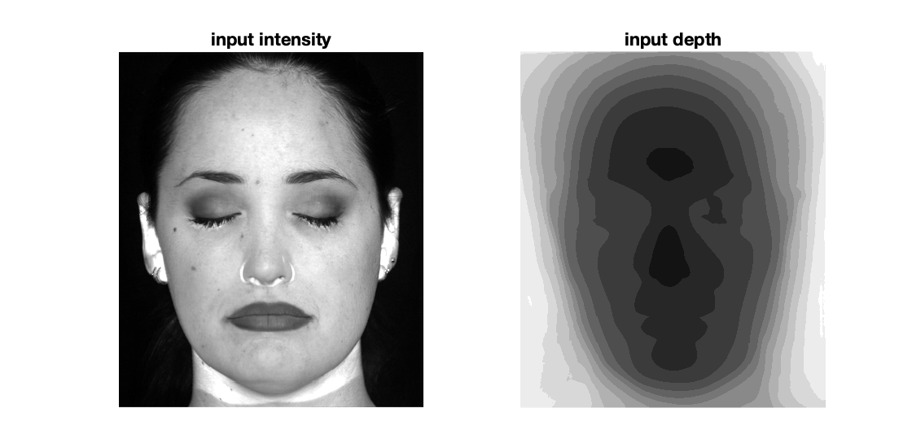

# 3DHologram

## Results
Results (simulated and captured) for multi-depth hologram:

Results (captured) for 2-depth hologram:

## Program
To replicate my simulation results, `cd src` and run `simulateHologram.m`. This is the main file that calls either `propagateMultiDepths`, `propagate2Depths`, or `propagate2DepthsIter`.

The input images to the pipeline are in the `data/scenes/` folder. The input used for the multi-depth hologram above is:
 

The generated outputs are:
- a Computed Generated Hologram (CGH), essentially a phase pattern to be displayed on the SLM. Scaled to the resolution of the SLM. Saved to the `data/CGH/` folder.
- simulated reconstructed views of the propagated hologram at different depths. Saved to the `data/reconstructions/` folder.

## Methods
<embed src='methods.pdf' type='application/pdf'>
